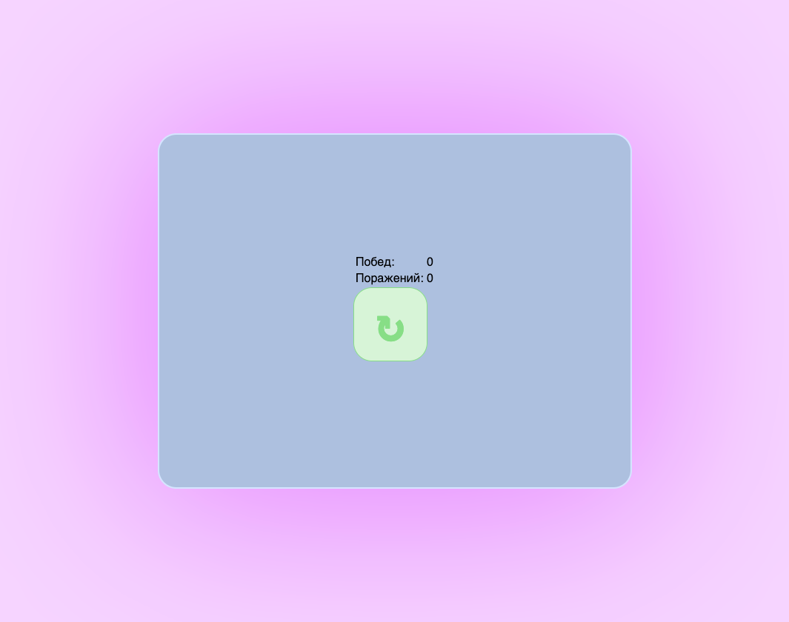
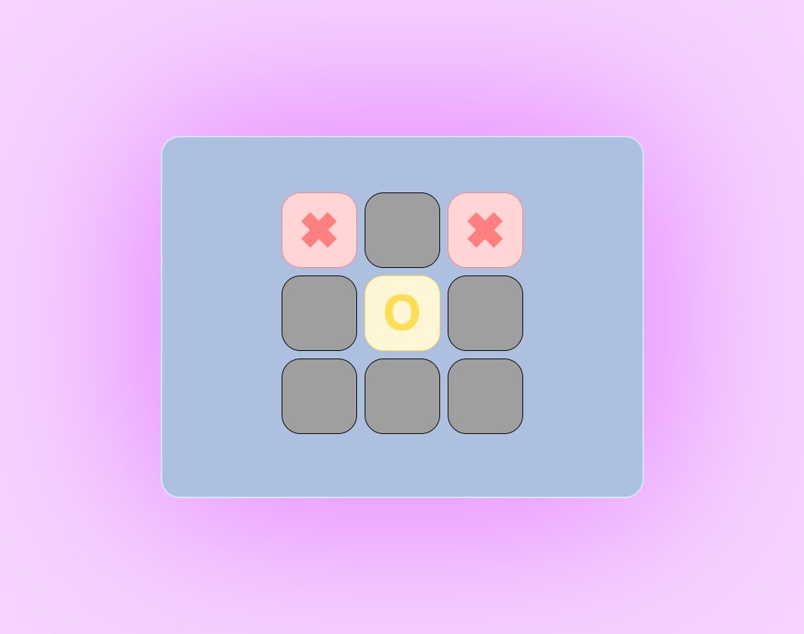

# tic-tac-js
Крестики нолики на JavaScript с использованием React. Игра хоть и простая, но над реализацией мы сильно заморочились. Позже планируется добавить ИИ, таблицу рекордов, онлайн игру.

# Для запуска в dev
```bash
> npm install
> npm start
```

# Для сборки в dev
```bash
> npm run build-dev
```

# Для сборки в production
```bash
> npm run build
И в HTML заменить все dev.js на min.js
```

# Скриншоты
>
> 
>
> 
>
> 
>
